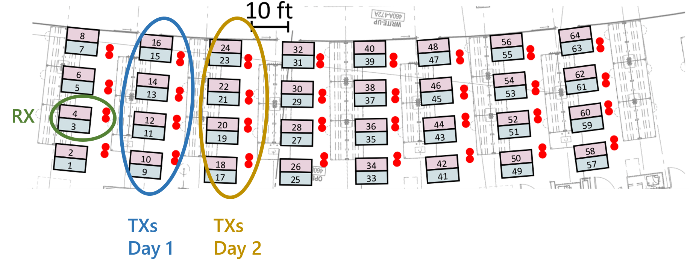

# Dataset Release: A Real World IEEE 802.11 a/g Dataset and Simulated LTE-M Uplink Dataset for Spectrum Sensing


This repository contains the code and links to the datasets curated and used in _[DeepSense: Fast Wideband Spectrum Sensing Through Real-Time In-the-Loop Deep Learning]_. The paper can be found for free [here] and cited using the key or citation found at the bottom


## Dataset Links
- SDR 802.11 a/g
- Simulated LTE-M Uplink

## Overview

Spectrum sharing will be a key technology to tackle spectrum  scarcity  in  the  sub-6  GHz  bands.  To  fairly  access  the shared bandwidth, wireless users will necessarily need to quickly sense  large  portions  of  spectrum  and  opportunistically  access unutilized  bands. To that end we have developed two datasets to help evaluate spectrum sensing methodolgies: a over the air real-world dataset collected using 5 USRP N210s with 802.11 a/g PHY layer waveforms and a simulated MATLAB dataset with LTE-M uplink PHY layer waveforms.

### Simulated LTE-M Uplink:

This dataset is created utilizing MATLABs LTE Toolbox to simulate LTE-M uplink transmissions in the Physical Uplink Shared Channel (PUSCH) over a 10-MHz-wide band. We split the spectrum band into 16 non-overlapping sub-bands (3 resource blocks or 540kHz wide), each acting as their own channel allocated to a user. The dataset that we used can be found using the link above but if one were to wish to generate their own they can use ```sim_lte_code/generateLTEDataset.m```. This script takes heavy inspiration from the following [MATLAB] example which is a highly recommended read to understand the code. The code will generate two ```.h5``` files, one as a training set and another as a test set for a specific SNR and input size to the CNN (i.e. ```lte_neg10_32_train.h5``` is the training data for a channel that experiences different holes with an SNR of -10 dBW and broken down into training samples containing 32 I/Q samples each). Within the ```.h5``` file, whether training or testing, there will be two groups ```'X'``` and ```'y'``` which will contain the I/Q training samples and labels respectively. We have provided our dataset for a 32 I/Q input size at varying SNRs as used in our final network.

### SDR 802.11 a/g:
This dataset emulates four 5-MHz-wide non-overlapping channels, occupying a total of 20 MHz bandwidth. We collected this dataset using 5 USRP N210s SDRs running GNU Radio. Four USRPs acted as WiFi transmitters, each with 64 sub-carriers, and one as the receiver sampling at 20MS/s to obtain the whole bandwidth. Data was collected from two separate days with two different transmitter orientations to give the dataset diversity in the SNR and  channel  effects  it  contained. Layout is shown below.



The dataset contains a 32 ```.bin``` files, 16 for the first day and 16 for the second day each of the 16 representing a different combination of bandwidth occupation (i.e. ```1101_day2.bin``` means the first, second, and fourth channels are occupied, collected on the second day). Each of these files contain a complex time series signal which can be read with 
```sh
import numpy as np
time_series_signal = np.fromfile(filepath, dtype=np.complex64, count=-1, offset=0)
```
Furthermore we have provided two scripts that first converts each ```.bin``` to an ```.h5```  file (```sdr_wifi_code/bin2hdf5.py```) and then generates a training and testing dataset with its corresponding labels (```sdr_wifi_code/preprocessing.py```).

## Citation

D. Uvaydov, S. D’Oro, F. Restuccia and T. Melodia, "DeepSense: Fast Wideband Spectrum Sensing Through Real-Time In-the-Loop Deep Learning," IEEE INFOCOM 2021 - IEEE Conference on Computer Communications, 2021, pp. 1-10, doi: 10.1109/INFOCOM42981.2021.9488764.

```sh
@inproceedings{uvaydov2021deepsense,
  title={Deepsense: Fast wideband spectrum sensing through real-time in-the-loop deep learning},
  author={Uvaydov, Daniel and D’Oro, Salvatore and Restuccia, Francesco and Melodia, Tommaso},
  booktitle={IEEE INFOCOM 2021-IEEE Conference on Computer Communications},
  pages={1--10},
  year={2021},
  organization={IEEE}
}
```


[//]: # 

   [DeepSense: Fast Wideband Spectrum Sensing Through Real-Time In-the-Loop Deep Learning]: <https://ieeexplore.ieee.org/abstract/document/9488764>
   [here]: <https://ece.northeastern.edu/wineslab/papers/UvaydovInfocom21.pdf>
   [MATLAB]: <https://www.mathworks.com/help/lte/ug/lte-m-uplink-waveform-generation.html>
